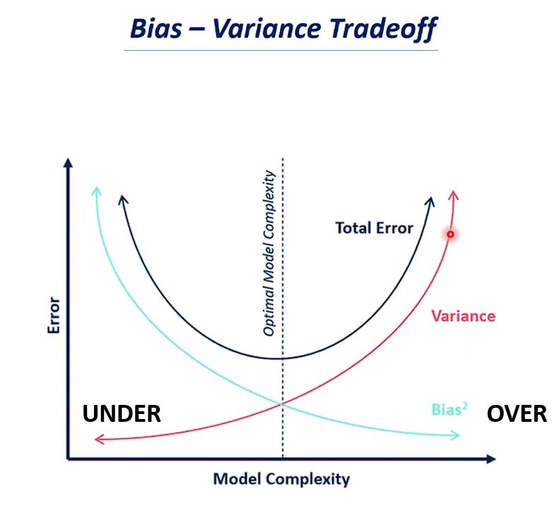

# Model Validation and Tuning

Steps involved in model validation and tuning (Regression example, on a continuos data) 
 

### 1. Get the data
### 2. Define the target (y) and features (X)
### 3. Split the data into training and testing set (validation if required)
### 4. Initiate a model, set parameters, and Fit the training set | `X_train, y_train`
### 5. Predict on `X_test`
### 6. Accuracy or Error metrics on `y_test` | Ex: Mean squared error, R squared
### 7. Bias-Variance trade-off check | Balancing underfitting and overfitting
### 8. Iterate to tune the model (from step 4)
### 9. Cross Validation | if model not generalizing well
### 10. Selecting the best model w/ Hyperparameter tuning

 

### [Check out Model Validation and Tuning](https://github.com/s1dewalker/Model_Validation/blob/main/Model_Validation.ipynb) 
 

Few Details:

## Bias-Variance trade-off

Bias = failing to find relationship b/w data and response, leading to underfitting  
Variance = following training data too closely, leading to overfitting  
 
Bias = ERROR due to OVERLY SIMPLISTIC models (underfitting) 
Variance = ERROR due to OVERLY COMPLEX models (overfitting) that are SENSITIVE TO FLUCTUATIONS (noise) in the training data. 
 

High Bias + Low Variance: Underfitting (simpler models)  
Low Bias + High Variance: Overfitting (complex models)  

