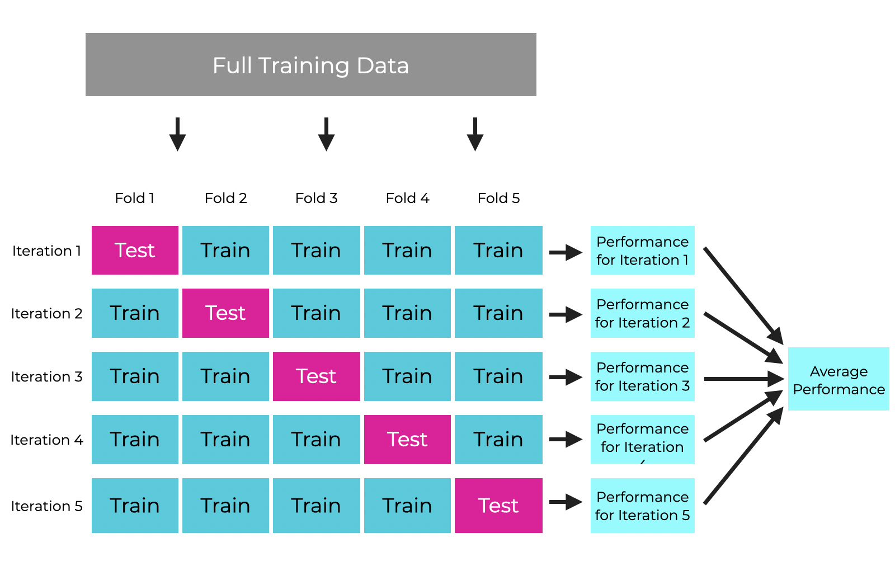
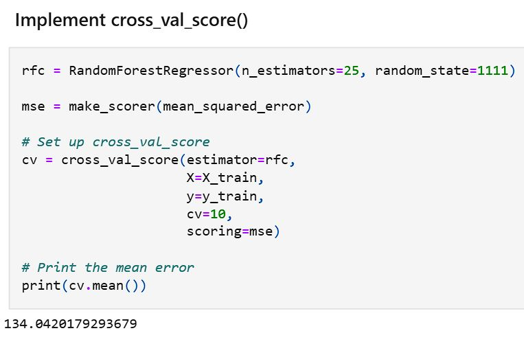

# Model Validation and Tuning
 

Steps involved in model validation and tuning (Regression example, on a continuos data)

### 1. Get the data
### 2. Define the target (y) and features (X)
### 3. Split the data into training and testing set (validation if required)
### 4. Initiate a model, set parameters, and Fit the training set | `X_train, y_train`
### 5. Predict on `X_test`
### 6. Accuracy or Error metrics on `y_test` | Ex: Mean squared error, R squared
### 7. Bias-Variance trade-off check | Balancing underfitting and overfitting
### 8. Iterate to tune the model (from step 4)
### 9. Cross Validation | if model not generalizing well
### 10. Selecting the best model w/ Hyperparameter tuning
 

### [Check out Model Validation and Tuning in Python](https://github.com/s1dewalker/Model_Validation/blob/main/Model_Validation.ipynb) 

  

Few Details:

## Bias-Variance trade-off

**Bias = failing to find relationship b/w data and response** = ERROR due to OVERLY SIMPLISTIC models (underfitting)  

**Variance = following training data too closely** = ERROR due to OVERLY COMPLEX models (overfitting) that are SENSITIVE TO FLUCTUATIONS (noise) in the training data  
 
 

High Bias + Low Variance: Underfitting (simpler models)  
Low Bias + High Variance: Overfitting (complex models)  
 
### **Training error high = Underfitting** 
### **Testing error >> Training error = Overfitting**  
  

## Cross Validation 

###### by sharpsightlabs.com

### Splitting data into distinct subsets. Each subset used once as a test set while the remaining as training set. Results from all splits are averaged.  
 
Why use?  

- Better Generalization: If our models are not generalizing well (Generalization refers to a model's ability to perform well on new, unseen data, not just the data it was trained on)
- Reliable Evaluation
- Efficient use of data (if we have limited data)
  
 
Types:  
1. **cross_val_score**

  
 
2. **Leave-one-out-cross-validation (LOOCV)**

Use when data is limited, but computationally expensive  
**Each data point is used as a test set**  

`cv = X.shape[0]`

 

